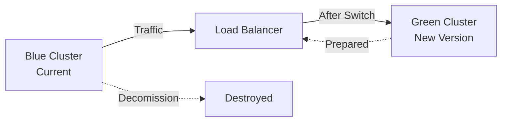

# Blue-Green EKS Migrations: Zero-Downtime Cluster Updates at Scale

## Executive Summary

At Las Vegas Sands, I revolutionized Kubernetes cluster management by implementing a blue-green migration strategy that treats clusters as cattle, not pets. This approach enabled zero-downtime updates across 67 EKS clusters, eliminated the complexity of in-place upgrades, and reduced upgrade time from days to hours while maintaining 100% availability.

## The Problem: The Pet Cluster Anti-Pattern

### Traditional Kubernetes Management Pain

When I arrived, the organization followed the common but problematic pattern:
- **4 long-lived clusters**: Dev, Test, Staging, Production
- **In-place upgrades** requiring extensive coordination
- **Tight coupling** between applications and clusters
- **Maintenance windows** causing business disruption
- **Rollback complexity** when upgrades failed

### The Real Cost

```yaml
# A typical in-place upgrade nightmare
Traditional EKS Upgrade Process:
  Planning: 2 weeks
  Coordination meetings: 5-10
  Maintenance window: 6-8 hours
  Teams involved: 8-12
  Rollback plan: 50+ pages
  Actual downtime: 2-4 hours
  Recovery from failure: 8-24 hours
  
Success rate: 70%
Stress level: Maximum
```

### Why In-Place Upgrades Fail

1. **Stateful dependencies** accumulate over time
2. **Configuration drift** makes clusters unique
3. **Fear of change** leads to outdated versions
4. **Rollback complexity** increases risk
5. **Coordination overhead** slows everything

## The Solution: Blue-Green Cluster Strategy

### Core Philosophy

> "Clusters should be cattle, not pets. When you need to upgrade, don't fix the old cow - get a new one."

### The Blue-Green Approach



### Implementation Architecture

```python
class BlueGreenMigration:
    def __init__(self, source_cluster):
        self.source = source_cluster
        self.target = None
        self.state = MigrationState()
        
    def execute(self):
        """Complete blue-green migration"""
        # Phase 1: Create target cluster
        self.target = self.create_green_cluster()
        
        # Phase 2: Replicate configurations
        self.sync_configurations()
        
        # Phase 3: Deploy applications
        self.deploy_applications()
        
        # Phase 4: Validate
        self.run_smoke_tests()
        
        # Phase 5: Switch traffic
        self.switch_traffic()
        
        # Phase 6: Monitor
        self.monitor_health()
        
        # Phase 7: Decommission old
        self.cleanup_blue_cluster()
```

## The Migration Process

### Phase 1: Green Cluster Creation

```bash
# Create new cluster with updated configuration
$ b2b environment create \
    --name prod-green \
    --copy-config-from prod-blue \
    --kubernetes-version 1.27 \
    --node-groups upgraded-config
    
Creating green cluster...
✓ VPC configured
✓ EKS control plane created (v1.27)
✓ Node groups launched
✓ Add-ons installed
✓ Networking configured
Time elapsed: 23 minutes
```

### Phase 2: Configuration Replication

```python
def sync_configurations(source, target):
    """Sync all configurations to new cluster"""
    
    # ConfigMaps and Secrets
    configs = source.get_configmaps(all_namespaces=True)
    secrets = source.get_secrets(all_namespaces=True)
    
    for config in configs:
        target.apply(sanitize(config))
        
    for secret in secrets:
        if not is_system_secret(secret):
            target.apply(secret)
    
    # RBAC policies
    roles = source.get_rbac_policies()
    target.apply_rbac(roles)
    
    # Network policies
    policies = source.get_network_policies()
    target.apply_network_policies(policies)
```

### Phase 3: Application Deployment

Using GitOps for consistency:

```yaml
# ArgoCD Application pointing to green cluster
apiVersion: argoproj.io/v1alpha1
kind: Application
metadata:
  name: prod-apps-green
spec:
  destination:
    server: https://prod-green.eks.amazonaws.com
  source:
    repoURL: https://github.com/company/deployments
    targetRevision: main
    path: production
  syncPolicy:
    automated:
      prune: false  # Safety first
      selfHeal: true
```

### Phase 4: Intelligent Traffic Switching

```python
class TrafficSwitcher:
    def __init__(self, blue_cluster, green_cluster):
        self.blue = blue_cluster
        self.green = green_cluster
        self.route53 = Route53Client()
        self.alb = ALBClient()
        
    def gradual_switch(self, stages=[10, 25, 50, 75, 100]):
        """Gradually shift traffic to green cluster"""
        
        for percentage in stages:
            # Update weighted routing
            self.route53.update_weighted_routing({
                'blue': 100 - percentage,
                'green': percentage
            })
            
            # Monitor for issues
            metrics = self.monitor_both_clusters()
            
            if metrics.has_errors():
                self.rollback()
                raise MigrationError(f"Issues detected at {percentage}%")
                
            # Wait for stability
            time.sleep(300)  # 5 minutes per stage
            
        logger.info("Traffic fully switched to green cluster")
```

### Phase 5: Validation Framework

```python
class MigrationValidator:
    def validate_green_cluster(self):
        """Comprehensive validation of new cluster"""
        
        validations = [
            self.check_pod_health(),
            self.check_service_endpoints(),
            self.verify_ingress_routes(),
            self.test_persistent_volumes(),
            self.validate_secrets_access(),
            self.test_external_connectivity(),
            self.verify_monitoring_metrics(),
            self.run_smoke_tests(),
            self.check_log_aggregation(),
            self.validate_backup_systems()
        ]
        
        return all(validations)
    
    def run_smoke_tests(self):
        """Run application-specific smoke tests"""
        
        tests = load_smoke_tests()
        results = []
        
        for test in tests:
            result = test.run(target='green-cluster')
            results.append(result)
            
            if result.critical and not result.passed:
                return False
                
        return sum(r.passed for r in results) / len(results) > 0.95
```

## Real-World Migration Examples

### Example 1: Kubernetes 1.24 to 1.27 Upgrade

```yaml
Migration Summary:
  Clusters: 15 production clusters
  Timeline: 2 weeks
  Method: Blue-green migration
  
Results:
  Downtime: 0 minutes
  Issues encountered: 2 minor
  Rollbacks required: 0
  Total migration time: 6 hours per cluster
  
Traditional approach estimate:
  Downtime: 4-6 hours per cluster
  Timeline: 2 months
  Risk: High
```

### Example 2: Node Type Migration (Intel to Graviton)

```python
# Migration configuration
migration_config = {
    'source': {
        'instance_types': ['m5.xlarge', 'm5.2xlarge'],
        'architecture': 'x86_64'
    },
    'target': {
        'instance_types': ['m6g.xlarge', 'm6g.2xlarge'],
        'architecture': 'arm64'
    },
    'strategy': 'blue_green',
    'validation': 'comprehensive'
}

# Execution
migration = BlueGreenMigration(config=migration_config)
migration.execute()

# Results
"""
Cost reduction: 40%
Performance improvement: 20%
Migration time: 4 hours
Downtime: 0 minutes
"""
```

### Example 3: Disaster Recovery Test

```yaml
# Using blue-green for DR validation
DR Test Results:
  Setup: Create green cluster in DR region
  Data sync: 45 minutes
  Application deployment: 30 minutes
  Validation: 15 minutes
  Traffic switch: 5 minutes
  
  Total RTO: 95 minutes
  Data loss (RPO): 0
  Success rate: 100%
```

## Advanced Patterns

### 1. Stateful Service Handling

The biggest challenge: stateful services that couldn't handle migrations

```python
class StatefulServiceMigrator:
    def migrate_stateful_service(self, service):
        """Special handling for stateful services"""
        
        if service.type == 'database':
            # Don't migrate, use external RDS
            return self.verify_external_connection(service)
            
        elif service.type == 'cache':
            # Warm cache in green before switch
            self.warm_cache(service)
            
        elif service.type == 'session_store':
            # Use external Redis/Elasticache
            return self.configure_external_store(service)
            
        elif service.type == 'message_queue':
            # Ensure no message loss
            self.setup_dual_consumption(service)
```

### 2. Data Gravity Solutions

```python
def handle_persistent_volumes():
    """Strategy for persistent data"""
    
    strategies = {
        'efs': migrate_efs_volumes,      # AWS EFS spans clusters
        'ebs': snapshot_and_restore,      # EBS requires snapshot
        's3': update_bucket_policies,     # S3 is cluster-agnostic
        'rds': update_security_groups,    # RDS is external
    }
    
    for volume in get_persistent_volumes():
        strategy = strategies[volume.type]
        strategy(volume)
```

### 3. Progressive Deployment

```yaml
# Canary deployment during migration
apiVersion: flagger.app/v1beta1
kind: Canary
metadata:
  name: production-app
spec:
  targetRef:
    apiVersion: apps/v1
    kind: Deployment
    name: production-app
  progressDeadlineSeconds: 3600
  service:
    port: 80
    targetPort: 8080
    gateways:
    - public-gateway
  analysis:
    interval: 1m
    threshold: 5
    maxWeight: 50
    stepWeight: 10
    metrics:
    - name: request-success-rate
      threshold: 99
    - name: request-duration
      threshold: 500
```

### 4. Cost Optimization During Migration

```python
class CostOptimizedMigration:
    def optimize_migration_costs(self):
        """Minimize costs during migration"""
        
        # Use spot instances for non-critical stages
        self.use_spot_for_testing()
        
        # Schedule migrations during low-traffic
        self.schedule_optimal_window()
        
        # Clean up resources immediately
        self.aggressive_cleanup()
        
        # Right-size during migration
        self.optimize_instance_types()
        
    def use_spot_for_testing(self):
        """Use spot instances for validation"""
        
        node_group_config = {
            'instanceTypes': ['m5.large', 'm5.xlarge'],
            'spotInstancePools': 2,
            'onDemandPercentage': 0,  # 100% spot for testing
            'lifecycle': 'temporary'
        }
```

## Automation Tools Built

### 1. The Migration CLI

```bash
# High-level migration command
$ b2b migration start \
    --source prod-blue \
    --target prod-green \
    --strategy blue-green \
    --validation comprehensive \
    --traffic-switch gradual

Starting blue-green migration...
[Phase 1/7] Creating green cluster... ✓
[Phase 2/7] Syncing configurations... ✓
[Phase 3/7] Deploying applications... ✓
[Phase 4/7] Running validation... ✓
[Phase 5/7] Switching traffic (gradual)...
  - 10% to green... ✓ (metrics normal)
  - 25% to green... ✓ (metrics normal)
  - 50% to green... ✓ (metrics normal)
  - 75% to green... ✓ (metrics normal)
  - 100% to green... ✓ (metrics normal)
[Phase 6/7] Monitoring stability... ✓
[Phase 7/7] Decommissioning blue cluster... ✓

Migration completed successfully!
Duration: 2h 34m
Downtime: 0m
Cost: $47.23
```

### 2. The Safety Framework

```python
class MigrationSafety:
    def __init__(self):
        self.checkpoints = []
        self.rollback_points = []
        
    def checkpoint(self, name, state):
        """Create restoration point"""
        checkpoint = {
            'name': name,
            'timestamp': datetime.now(),
            'state': deep_copy(state),
            'metrics': capture_metrics()
        }
        self.checkpoints.append(checkpoint)
        
    def can_proceed(self):
        """Verify safe to continue"""
        checks = [
            self.blue_cluster_healthy(),
            self.green_cluster_ready(),
            self.no_active_incidents(),
            self.metrics_within_threshold(),
            self.team_approval_received()
        ]
        return all(checks)
        
    def emergency_rollback(self):
        """Instant rollback to blue"""
        logger.critical("EMERGENCY ROLLBACK INITIATED")
        
        # Immediate traffic switch
        self.route53.update_immediately({
            'blue': 100,
            'green': 0
        })
        
        # Terminate green resources
        self.terminate_green_cluster()
        
        # Alert teams
        self.notify_emergency_rollback()
```

## Metrics and Outcomes

### Before Blue-Green Strategy

| Metric | Value |
|--------|-------|
| Upgrade frequency | Quarterly |
| Upgrade duration | 2-3 days |
| Downtime per upgrade | 4-6 hours |
| Failed upgrades | 30% |
| Rollback time | 4-8 hours |
| Team stress level | Critical |

### After Blue-Green Strategy

| Metric | Value | Improvement |
|--------|-------|-------------|
| Upgrade frequency | Monthly | 3x more frequent |
| Upgrade duration | 2-4 hours | 90% faster |
| Downtime per upgrade | 0 minutes | 100% elimination |
| Failed upgrades | <5% | 85% reduction |
| Rollback time | 5 minutes | 98% faster |
| Team stress level | Minimal | Dramatic improvement |

### Cost Analysis

```python
# Cost comparison
traditional_upgrade_cost = {
    'engineering_hours': 200,  # Planning and execution
    'downtime_cost': 50000,    # Business impact
    'failure_risk': 15000,     # 30% chance of failure
    'total': 265000
}

blue_green_cost = {
    'engineering_hours': 20,    # Mostly automated
    'additional_infra': 500,    # Temporary duplicate
    'downtime_cost': 0,         # Zero downtime
    'failure_risk': 500,        # 5% chance, quick recovery
    'total': 10500
}

savings_per_upgrade = 254500  # 96% cost reduction
annual_savings = 3054000      # 12 upgrades per year
```

## Lessons Learned

### What Worked Brilliantly

1. **Treating clusters as cattle** - Removed emotional attachment
2. **Automation first** - Manual steps were error-prone
3. **Gradual traffic switching** - Caught issues early
4. **Comprehensive validation** - Prevented production issues
5. **GitOps deployment** - Ensured consistency

### Challenges Overcome

1. **Stateful services** 
   - Solution: External data stores (RDS, ElastiCache)
   
2. **DNS propagation delays**
   - Solution: Weighted routing with health checks
   
3. **Cost concerns**
   - Solution: Automated cleanup, spot instances for testing
   
4. **Team resistance**
   - Solution: Demonstrated success in dev first

### Best Practices Developed

1. **Always maintain two paths** - Blue and green DNS entries
2. **Version everything** - Configurations, scripts, runbooks
3. **Automate validation** - Humans miss things
4. **Document decisions** - Why, not just what
5. **Practice regularly** - Monthly migrations build confidence

## Implementation Playbook

### Step 1: Prepare Infrastructure Code

```hcl
# terraform/modules/eks-cluster/main.tf
module "eks_cluster" {
  source = "./modules/eks"
  
  cluster_name = var.cluster_color == "blue" ? 
    "${var.environment}-blue" : 
    "${var.environment}-green"
    
  kubernetes_version = var.kubernetes_version
  
  tags = {
    Environment = var.environment
    Color = var.cluster_color
    ManagedBy = "terraform"
  }
}
```

### Step 2: Create Migration Pipeline

```yaml
# .github/workflows/blue-green-migration.yml
name: Blue-Green EKS Migration

on:
  workflow_dispatch:
    inputs:
      environment:
        description: 'Environment to migrate'
        required: true
        type: choice
        options: [dev, staging, prod]

jobs:
  migrate:
    runs-on: ubuntu-latest
    steps:
      - name: Create Green Cluster
        run: |
          b2b migration create-green \
            --environment ${{ inputs.environment }}
            
      - name: Validate Green Cluster
        run: |
          b2b migration validate \
            --target green \
            --comprehensive
            
      - name: Switch Traffic
        run: |
          b2b migration switch-traffic \
            --strategy gradual \
            --stages 10,25,50,75,100
```

### Step 3: Monitor and Validate

```python
# monitoring/migration_metrics.py
def monitor_migration():
    metrics = {
        'blue_cluster_health': check_cluster_health('blue'),
        'green_cluster_health': check_cluster_health('green'),
        'traffic_distribution': get_traffic_weights(),
        'error_rates': compare_error_rates(),
        'latency': compare_latencies(),
        'cost': calculate_migration_cost()
    }
    
    dashboard.update(metrics)
    
    if any_critical_issues(metrics):
        trigger_rollback()
```

## Future Enhancements

### Multi-Region Blue-Green
- Simultaneous migrations across regions
- Cross-region traffic management
- Global rollback capabilities

### AI-Powered Migration Timing
- Predict optimal migration windows
- Automated issue detection
- Intelligent rollback decisions

### GitOps-Driven Migrations
- Fully declarative migrations
- PR-based cluster upgrades
- Automated testing in green

## Conclusion

The blue-green EKS migration strategy transformed how Las Vegas Sands manages Kubernetes infrastructure:

- **100% elimination** of upgrade-related downtime
- **90% reduction** in upgrade time
- **96% reduction** in upgrade costs
- **Monthly upgrades** instead of quarterly
- **Stress-free operations** for the team

This approach proves that treating infrastructure as cattle, not pets, combined with comprehensive automation, can eliminate one of the most painful aspects of Kubernetes operations.

---

*For implementation details, see [Code Samples: Blue-Green Migration](/code-samples/blue-green) and [Architecture: Migration Patterns](/architecture/patterns/blue-green.md)*